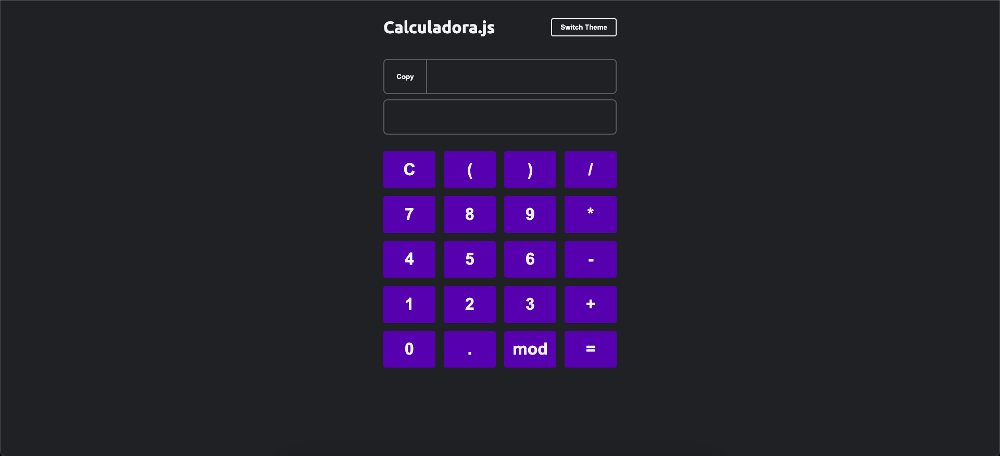
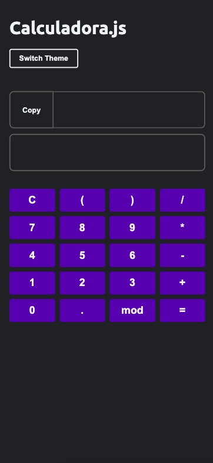

# Calculadora Javascript

Uma calculadora simples desenvolvida em Javascript.

- Last update: changed from script.js to module

## Screenshots

## Authors

| [ Hiago Souza](https://github.com/ohiagosouza) |
| :---------------------------------------------------------------------------------------------------------------------------------------: |
|                                             [Linkedin](https://www.linkedin.com/in/ohiagosouza)

